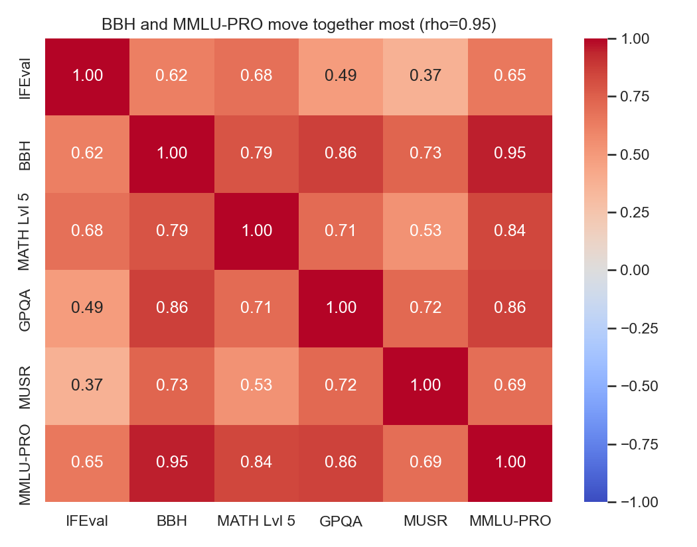
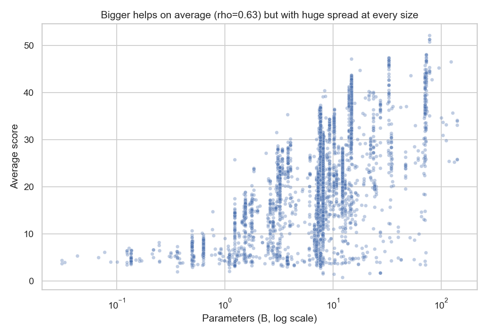
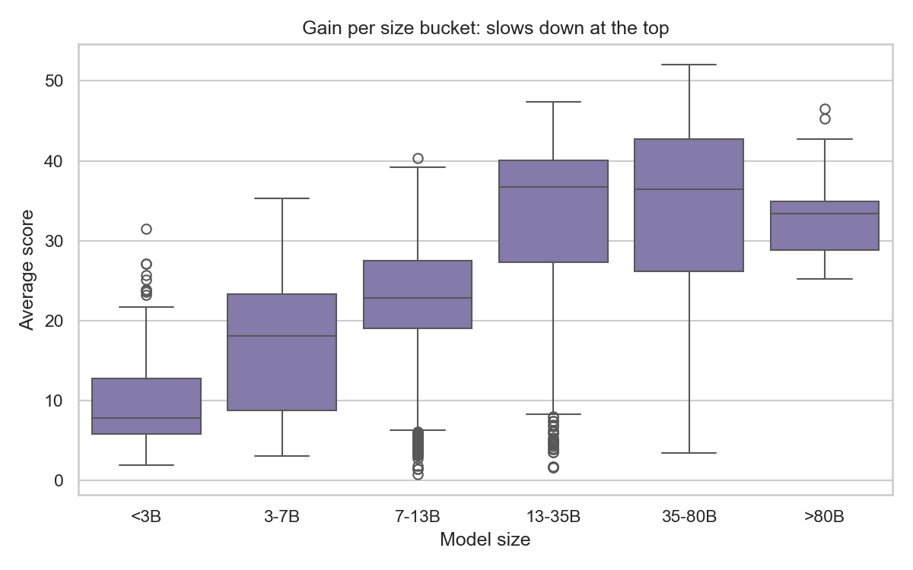
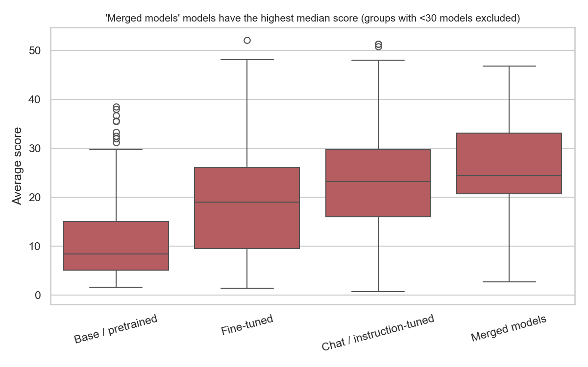
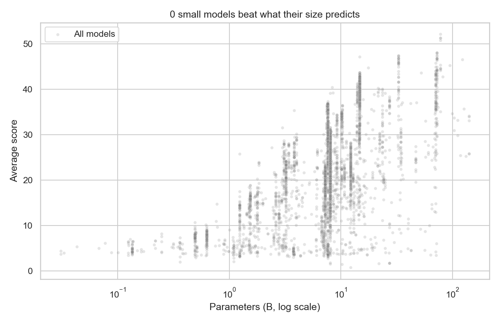

# AI Benchmark Data Analysis — Open LLM Leaderboard

This project treats the Hugging Face Open LLM Leaderboard like a benchmark report under review: validate the raw data, test the scoring logic, measure benchmark relationships, and flag suspicious model behavior before explaining what it means.

**Stack:** Python, Pandas, NumPy, SciPy, Matplotlib, Seaborn  
**Notebook:** `ai_benchmark_analysis_v2.ipynb`  
**Topics:** `llm`, `benchmark-analysis`, `data-quality`, `python`, `notebook`

## Executive summary

I treated the Open LLM Leaderboard like a benchmark report under review. Of 4,576 model entries, the reported averages matched my own recalculation exactly and no score was missing or outside 0–100, so the scoring itself is consistent. The data-quality problems are in the metadata: 79 duplicate model names, 10 entries with a missing or zero size, and two entries whose reported size (a few million parameters) is implausible and distorted the first anomaly search until I excluded them.

BBH and MMLU-PRO move together almost perfectly (Spearman rho = 0.95), while IFEval and MUSR are the least related (rho = 0.37), so a single average score hides very different skill profiles. Bigger models score higher overall (rho = 0.63), but the gain is not constant: the median rises from about 8 points under 3B parameters to about 37 at 13–35B, then stops improving (about 36 at 35–80B; the over-80B group has only 16 models, so I would not draw conclusions from it). Fine-tuned, chat, and merged models all score well above base models, whose median is lowest.

Most statistical outliers (250 models) come from MATH Lvl 5 and GPQA, where the score distribution has a long upper tail, so they reflect specialisation rather than errors. A further 64 models have very uneven profiles, and at least 11 of the 15 most extreme are variants of the same base model (Phi-4: strong on GPQA, weak on IFEval), which shows these are family effects, not 64 independent surprises. None of this proves contamination or error; the model cards and training data need to be checked before concluding anything.

The `Flagged` column was all `False` in the cleaned dataset, so it did not explain the anomalies. The main issues were duplicate names, the missing/implausible size values, and the skewed benchmark distributions.

## Key results

| Check | Result |
|---|---|
| Raw records | 4,576 |
| Clean records | 4,497 |
| Benchmarks analyzed | 6 |
| Duplicate model names | 79 |
| Missing or non-positive size | 10 |
| Implausibly tiny sizes | 2 |
| Most correlated benchmarks | BBH and MMLU-PRO (rho 0.95) |
| Least correlated benchmarks | IFEval and MUSR (rho 0.37) |
| Size vs average score | rho 0.63 |
| IQR outliers | 250 models |
| Imbalanced-profile models | 64 |

## Visual findings

### 1) Correlation heatmap


### 2) Size vs score


### 3) Median score by size bucket


### 4) Scores by model type


### 5) Anomaly detection


## Method

1. **Data integrity checks:** dtype validation, missing values, duplicates, score range checks, recomputed average checks, and implausible size filtering.
2. **Exploratory analysis:** score distributions, pairwise benchmark correlations, size-vs-score trend, and performance by model family.
3. **Anomaly detection:** IQR outlier detection, size-adjusted overperformance, and uneven benchmark profiles.

## Limitations

- Duplicate model names were treated as duplicates without checking whether they represent legitimate re-evaluations.
- Median performance by size bucket is influenced by the model mix in each bucket.
- IQR-based outlier counts are inflated for skewed benchmarks like MATH Lvl 5 and GPQA.
- This data alone cannot distinguish contamination, data quality issues, or genuine training improvements.

## Reproduce

```bash
pip install datasets pandas numpy matplotlib seaborn scipy jupyter
jupyter nbconvert --to notebook --execute --ExecutePreprocessor.kernel_name=python3 ai_benchmark_analysis_v2.ipynb
```

If the dataset is unavailable, load a CSV copy or swap in a local backup in the loader cell before rerunning the notebook.

## Notebook

Open the analysis notebook here:

- `ai_benchmark_analysis_v2.ipynb`
